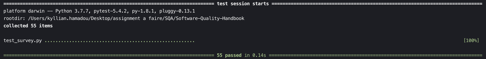
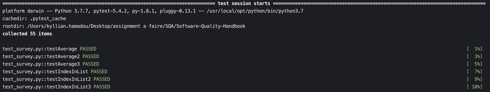
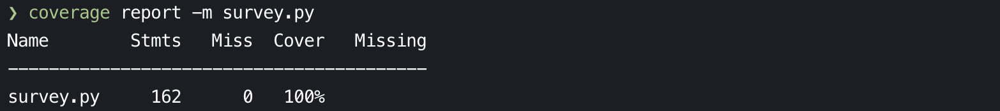
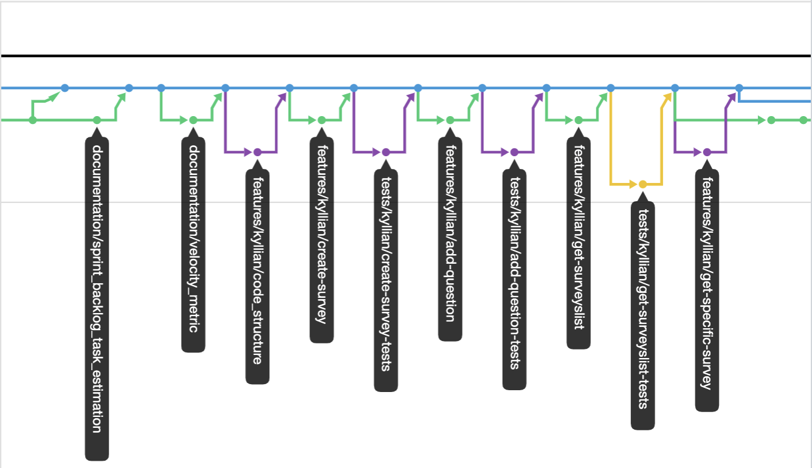

# SQA - Final Assignment

## Introduction

First of all, this project is a software component in Python to store information about surveys and responses. This document is an handbook of best practices which highlights the good methods to follow in order to carry out a project successfully in a company. This document will cover these following themes:

- [SQA - Final Assignment](#sqa---final-assignment)
	- [Introduction](#introduction)
	- [Project description](#project-description)
- [Sprint backlog and task estimation](#sprint-backlog-and-task-estimation)
- [Velocity Metric](#velocity-metric)
- [Project documentation](#project-documentation)
- [Unit testing and Test-Driven development](#unit-testing-and-test-driven-development)
- [Test coverage metric](#test-coverage-metric)
- [Team version-control](#team-version-control)
- [Code-review checklist](#code-review-checklist)

## Project description

The goal of this project is to create a software component for storing survey and response information. Each survey is composed of several questions (up to a maximum of 10). Each SurveyResponse must contain an answer to each question in its survey, where the answer will be an integer value between 1 and 5 (i.e. representing a Likert scale).

# Sprint backlog and task estimation

As a reminder, the sprint backlog is the set of user stories from the product backlog that the team commits to deliver by the end of the sprint (user stories are put in the sprint backlog according to their business value and technical complexity). Thus, the most important work will be done first.

- **Task n°1: Create the Controller**

  **Description:** The controller allows access to the different functions of our class "Survey" and our class "SurveyResponse". So, from the controller, we can for example create a survey, add a question or even get the statistics of a survey. In short, the controller is the structure of our program.
   

  **Task Estimation:** 1 hour.
   

  **Explanation:** Taking into account the implementation of all the functions of our classes, the controller is a longer task because it is simply the structure of our program. It is via this class Controller that we will manage the whole creation of a survey, add questions, answers and call the statistics functions.

- **Task n°2: Create a Survey**
  
  **Description:** It is essential to be able to create a survey. Therefore you need to create a function in our class "Survey", called in our Controller class, to be able to create a survey. The function will take the name of the survey you want to create as a parameter. When the function is called and does not return an error, it returns that the survey has been created successfully.
   

  **Task Estimation:** 40 minutes.
   

  **Explanation:** Create a survey takes 40 minutes to do because you have to consider the fact that it creates the class "Survey", while managing the error handling (for example, if the name of the survey is well given). The possibility of calling the function via the Controller must also be implemented. This is a much shorter task than the creation of the controller but it is still a main and important function for the realization of a survey.

- **Task n°3: Add a Question**

  **Description:** In a survey, it is essential to add a question. Now that the class "Survey" has been created, we just have the function to create and implement in our class Controller and in our class Survey. The function takes in parameter the name of the survey in which we want to add the question and finally the question. When the function doesn't return any errors, we are left with the fact that the question has been added.
   

  **Task Estimation:** 20 minutes.
   

  **Explanation:** Adding a question in a survey takes 20 minutes to do because you have to manage all the error handling (for example, if the survey is already created before adding a question). To compare with the Task n°2, it's shorter because we can see that there is just the function to create and implement in our class Controller and Survey.

- **Task n°4: Get a list of all surveys**

  **Description:** This function allows you to have a list of all the surveys you have created. This function doesn't take anything in parameters because we only want to get the list of all the surveys we have created before.
   

  **Task Estimation:** 5 minutes.
   

  **Explanation:** Getting a list of all the surveys you have created is very simple. In fact, you just have to return the array containing all the surveys. When there is no survey created, the function only returns an empty table. The estimation of this task is therefore very short compared to other functions.

- **Task n°5: Get a specific survey**

  **Description:** This function allows us to access a particular survey via its name. Indeed, the function takes the name of the survey we are looking for and if it exists, the survey is returned and we can access the questions we have added to it.
   

  **Task Estimation:** 10 minutes.
   

  **Explanation:** Just like Task n°4, it is quite similar but a little bit longer to do because there is an error handling to implement because the survey in question must be created beforehand otherwise an error will appear. It is a simple task on the whole and requires little implementation time.

- **Task n°6: Add a response**

  **Description:** Adding a response to a survey question is one of the main features of our project. Indeed, this function will lead to the creation of another class that will be called "SurveyResponse". In this class, we will link each response to a survey. And each response will be linked to a user. This function will therefore take the name of the survey, the response and finally the user email in order to identify the person who responded to the survey.
   
  
  **Task Estimation:** 1 hour.
   

  **Explanation:** Similar to Task n°3, this task is more complicated because it involves the creation of another "SurveyResponse" class and the fact that you have to link a user's responses to a survey. In comparison, having a large error handling and implementation via our Controller, our Survey class and finally in the last "SurveyResponse" class, this task will take about 1 hour to complete.

- **Task n°7: Get Survey Responses**

  **Description:** This function will allow you to have all the answers given by all the users of a particular survey. This function will just take the name of the survey in parameter and return an array with all the answers of each user.
   

  **Task Estimation:** 10 minutes.
   

  **Explanation:** Like Task n°5, it is simply a matter of returning all the answers to a particular survey. The error handling will take a few minutes to do but the task is quite simple to perform.

- **Task n°8: Get Survey Statistics**

  **Description:** This function allows you to have statistics of a survey in its entirety with all the answers of all the users. This function will take the name of the survey and return the minimum, maximum, average and standard deviation. An error will be returned if something goes wrong.
   
  
  **Task Estimation:** 20 minutes.
   

  **Explanation:** In terms of difficulty, this is not the hardest task because in Python, we can easily make quick calculations such as average, min or max value, or even standard deviation. The longest thing to do will be the structure of the function to know how to get all the answers from all the users and how to calculate all the values between them.

- **Task n°9: Get Question Statistics**

  **Description:** This function should provide the average, standard deviation, minimum and maximum score for a specific question on a Survey. The function will then take the question and the name of the survey as parameters. The function will then return the values of the different calculations.
   

  **Task Estimation:** 20 minutes.
   

  **Explanation:** Almost the same task as the Task n°8, there is a strong errors handling required for this function. The calculations are not the hardest to do but the structure of the code is, it will take 20 minutes to correctly implement this function in our different classes.

- **Task n°10: Other functions needed**

  **Description:** We will need 3 other functions (out of features) that will allow us to manage error handling and statistics. One function will have the role of simply giving the average of an array. Another function will tell us if an index exists in an array to avoid crashing our program. Finally, the last function will allow us to know if the user has put an answer between 1 and 5. (as the liker scale model).
   

  **Task Estimation:** 15 minutes.
   

  **Explanation:** About 5 minutes per function, they are not hard to develop but they are necessary for the good development of our program and will help us for the error management.

# Velocity Metric

Velocity is the number of tasks a team completes during a sprint. To measure it, simply add up the number of tasks delivered in the last few sprints and average them. To have a reliable average, the velocity must be calculated over a minimum of 3 sprints. In addition, the experience helps in measuring the velocity metric of a sprint.

Velocity metric is an essential feedback mechanism for the team. It helps them measure whether the process changes they make improve or hinder their productivity. It also allows them to predict very precisely how many stories a team can make in a sprint.

Without the Velocity, release planning is impossible. By knowing speed, a product owner can determine how many sprints it will take the team to reach the desired level of functionality, which can then be delivered. Based on the duration of the sprint, the product owner can set a release date.

# Project documentation

First of all, here is the structure of our code.

There are 3 classes:

1. Controller:
   - Parameters:
     - surveyList: **`Array`**

2. Survey:
   - Parameters:
     - surveyName: **`String`**
     - questions: **`Array`**
     - surveyResponses: **`Array`**

3. SurveyResponse:
   - Parameters:
     - userEmail: **`String`**
     - responses: **`Array`**

Thanks to our Controller class, all the functionalities of the project are reachable. The Controller class is composed of 8 asked functions.

First, we need to initialized our Controller class:

<pre><code> mySurvey = Controller()</code></pre>

Now, you will be able to call all the function contains in the Controller Class throught the **mySurvey** variable.

- **CreateSurvey(surveyName)**

Thanks to this function you can create a new survey. You may create as many surveys as you want. You have to send in parameter the name of your survey. For example, you just have to call the function like this:

<pre><code> mySurvey.CreateSurvey("Example Survey")</code></pre>

The function will return you:

<pre><code>> Example Survey have been created</code></pre>

- **GetSurveysList()**

This function give us the possibility to retrieve all the surveys created before. You may call the function like this:

<pre><code>surveyList = mySurvey.GetSurveysList()</code></pre>

The function will return you an **array** of Survey class where there are all the surveys created before. You may access have all the name of all surveys by using a loop like this:

<pre><code>for survey in surveysList:
  print (survey.surveyName)

OUTPUT:
> Example Survey
</code></pre>

If there is no survey created, the function will return you an empty array of Survey class.

- **AddQuestion(surveyName, question)**

This function allows us to add a question in a specific survey. You have to send the name of the survey and the question in parameter. You may call the function like this:

<pre><code>mySurvey.AddQuestion("Example Survey", "Example Question")</code></pre>

If all went well, the function will return:

<pre><code>> 'Example Question' have been added in your survey 'Example Survey'</code></pre>

In case of errors, the function may return you this:

- If the survey doesn't exist, the function will return you:
<pre><code>> Error: Sorry, you can't add a question because the survey 'Example Survey' doesn't exist</code></pre>

- If you want to add more than 10 questions in a survey, the function will return you:
<pre><code>> Error: You can't add more than 10 questions</code></pre>

- **GetSurvey(surveyName)**

By making a call to this function, we can retrieve a specific survey. You just have to send the name of the survey in parameter. You may call the function like this:

<pre><code>exampleSurvey = mySurvey.GetSurvey("Example Survey")</code></pre>

If all went well, the function will return you the specific survey. Then, you will be able to retrieve the questions of this specific survey like that:

<pre><code>questions = exampleSurvey.questions
print(questions)

OUTPUT:
> ['Example Question']
</code></pre>

_Note: If there is no questions in the survey, the function will return you an empty array._

In case of errors, the function may return you this:

- If the survey doesn't exist, the function will return you:
<pre><code>> Error: Sorry, the survey 'Example Survey' doesn't exist</code></pre>

- **AddResponse(surveyName, response, userEmail)**

This function allows us to add a response in a specific survey. You have to send the name of the survey, the response (an integer between 1 and 5) and the user email in parameter. You may call the function like this:

<pre><code>mySurvey.AddResponse("Example Survey", 3, "kyllian@epitech.eu")</code></pre>

If all went well, the function will return you:

<pre><code>The response '3' have been added by 'kyllian@epitech.eu' in the survey 'Example Survey'
</code></pre>

In case of errors, the function may return you this:

- If the format of the response isn't the good one, the function will return you:
<pre><code>> Error: The response must be an integer between 1 and 5.</code></pre>

- If the response given isn't a valid integer, the function will return you:
<pre><code>> Error: The response must be a valid integer.</code></pre>

- If the survey doesn't exist, the function will return you:
<pre><code>> Error: Sorry, you can't add a response because the survey 'Example Survey' doesn't exist.</code></pre>

- If you want to add more responses than the number of questions:
<pre><code>> Error: You can't add more responses than the number of question.</code></pre>

- If there is no questions:
<pre><code>> Error: Sorry, you can't add a response because there is no questions</code></pre>

- **GetSurveyResponses(surveyName)**

This function give us the possibility to retrieve all the responses of a specific survey. You may call the function like this:

<pre><code>surveyResponses = mySurvey.GetSurveyResponses("Example Survey")</code></pre>

If all went well, the function will return you the specific survey response class. Then, you will be able to retrieve the responses of the users of this specific survey like that:

<pre><code>for surveyResponse in surveyResponses:
  print("user: ", surveyResponse.userEmail , "| responses: ", ", ".join(str(response) for response in surveyResponse.responses))

OUTPUT:
> user:  kyllian@epitech.eu | responses:  3
</code></pre>

In case of errors, the function may return you this:

- If the survey doesn't exist, the function will return you:
<pre><code>> Error: Sorry, the survey 'Example Survey' doesn't exist.</code></pre>

* **GetSurveyStatistics(surveyName)**

Thanks to this function, we could have the statistic of the survey (the min value, the max value, the average, the standard deviation, and an error if occured). You have to send the name of the survey in parameter. You may call the function like this:

<pre><code>minValue, maxValue, average, sd, err = mySurvey.GetSurveyStatistics("Example Survey")</code></pre>

If all went well, the function will return you all the statistics of the survey.

In case of errors, the function may return you this:

- If the survey doesn't exist, the function will return you:
<pre><code>> Error: Sorry, the survey 'Example Survey' doesn't exist.</code></pre>

_Note: The standard deviation will return 'Error: It requires a minimum of 2 users to calculate the standard deviation' if there is only one user that answer of the questions of the survey_

- **GetQuestionStatistics(question, surveyName)**

Thanks to this function, we could have the statistic of a specific question of the survey (the min value, the max value, the average, the standard deviation, and an error if occured). You have to send a question and the name of the survey in parameter. You have to call the function like this:

<pre><code>minValue, maxValue, average, sd, err = mySurvey.GetQuestionStatistics("Example Question", "Example Survey")
</code></pre>

If all went well, the function will return you all the statistics of the specific question of the survey.

In case of errors, the function may return you this:

- If the survey doesn't exist, the function will return you:
<pre><code>> Error: Sorry, the survey 'Example Survey' doesn't exist.</code></pre>

_Note: The standard deviation will return 'Error: It requires a minimum of 2 users to calculate the standard deviation' if there is only one user that answer of the question of the survey_

# Unit testing and Test-Driven development

In computer programming, unit testing is a procedure for verifying the proper functioning of a specific piece of software or portion of a program.

For our project, I used **pytest** for unit tests. The pytest framework makes it easy to write small tests, yet scales to support complex functional testing for applications and libraries.

You can run your unit tests by executing this command:

<pre><code>$ pytest</code></pre>

After the execution of your tests, if everything is green that means all the tests are passed. However, if the output is with red color, it means that there are errors in your tests. In our project, each test has the same name as the test function in order to simplify the work of the developers and make the structure of our tests more understandable.

Test-Driven development is a development method that aims to reduce the anomalies of an application by encouraging frequent testing. The "Test first" policy would encourage developers to be more rigorous and to correct errors in near real time. The fact that the developer must create the test code before writing the first line would have an impact on the quality of the final product.

# Test coverage metric

This part is used to test our program in a general way and will show how to make the Code Cover Tool work. The code coverage tool I have chosen to use for this project is: **Coverage.py**

To introduce what **Coverage.py** is: it is a tool for measuring code coverage of Python programs. It monitors your program, noting which parts of the code have been executed, then analyzes the source to identify code that could have been executed but was not.

Coverage measurement is typically used to gauge the effectiveness of tests. It can show which parts of your code are being exercised by tests, and which are not.

First, you need to install **Coverage.py** using this command line in your terminal:
 

<pre><code>$ pip3 install coverage</code></pre>

Then, we will finally be able to use Coverage. Type the following command to run your test suite and collect data:
 

<pre><code>$ coverage run -m pytest</code></pre>

After executing this command line, your terminal will display something like this:

On our picture above, we can see that I have performed 55 test functions that are running and none of them failed.

In order to have more details to know which function is passed or not, use the following command:
 

<pre><code>$ coverage run -m pytest -v</code></pre>

It will give you something like that, with all the details of passed or failed functions (picture below).

It is also possible to use <code>coverage report</code> to report on the results. Execute the following command to get the details of our tests on our program:
 

<pre><code>$ coverage report -m survey.py</code></pre>

For our project, it will give you this kind of result.

We can see that, for our project, we covered 100% of our code. So we tested everything and missed no functions to test. We can see that we made 162 statements which corresponded to the result tests that our functions had to return.

Finally, still thanks to our Coverage tool, we can have a graphic version and a nicer presentation of our tests with the following command:
 

<pre><code>$ coverage html survey.py</code></pre>

This gives us a detailed report available on our local browser, showing us which part of the code was covered by our tests.

_Note: I upload this video on youtube if you need to check in more details the presentation of the tests in a better quality: https://www.youtube.com/watch?v=oWBVTojG-uc_

# Team version-control

Version management consists of managing all versions of one or more files. Mainly used in the field of software creation, it mainly concerns the management of source codes.

Being able to work on your own without impacting the work of others when developing the features of a project is one of the main challenges. For doing this, we use the tool called **Git** and follow a Gitflow process.

A Gitflow process is:

1. Creating our own git branch: Each developer of the project have to create his own git branch in order to avoid to overwrite or modify any source code of an another developer. His git branch must be created from the preprod branch. For clarity, each git branch name must include the name of the developer and the name of the feature. To create a git branch, execute this command by replacing the branchname:
<pre><code>$ git checkout -b [branchname] </code></pre>

2. Before to push any code, you have to pull the preprod branch to retrieve the code of all other developers. Then, type this following command:
<pre><code>$ git pull origin preprod</code></pre>

3. Now, you are on the latest version of preprod branch and up to date. You will be able to push your work with a specific message of your commit by following these commands:
  <pre><code>$ git add [files]
$ git commit -m "your commit message"
$ git push origin [branchname]</code></pre>

4. Lastly, you have to make a pull request to submit your final work on the preprod branch. You have to be sure that you are up to date with the preprod branch before submitting your work. Finally, when you will ask for a pull request, the project leader will review your code and validate your pull request for merging with the master branch.

Here, a sample of the Gitflow process for our project:

There are several tools to help you manage Git such as GitTower, GitKraken, and SourceTree. This can help you manage your branch and track the progress of your project in a more global way.

# Code-review checklist

Here the checklist of things that a reviewer should check and ask to himself when reviewing a pull request:

- [x] Is the code working ?
- [x] Is the code can be easily understood ?
- [x] Is there duplicate code ?
- [x] Any global variables be replaced ?
- [x] Is there commented code ?
- [x] Is there log or debug code ?
- [x] May any code should be replaced by built-in functions ?
- [x] Are there obvious optimizations for the performance ?
- [x] Is the error handling well done ?
- [x] Are input and output values checked ?
- [x] Are unit tests made for the code ?
- [x] Are all functions commented in the documentation ?
- [x] Is there incomplete code ?
- [x] Is any unusual behavior or errors described
- [x] Are invalid parameter values handled ?

There are tools to assess the quality of the code of the whole project is to use a tool for static analysis of the code. Don't hesitate to use tools such as SonarQube, NDepend, FxCop which are made for reviewers.

---

**KYLLIAN HAMADOU - D19124158**
